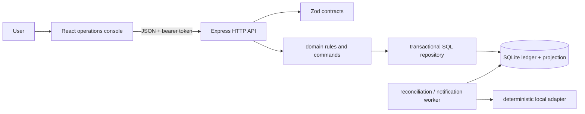

# Architecture

Dependencies point inward: contracts validate unknown boundary data; domain functions contain permissions/arithmetic/state rules; the API orchestrates SQL transactions. The worker is a separate process and shares only durable job/database contracts. Every protected repository statement includes the actor's trusted organization ID. Multi-write commands use one SQLite transaction; idempotency records commit with their effect.
