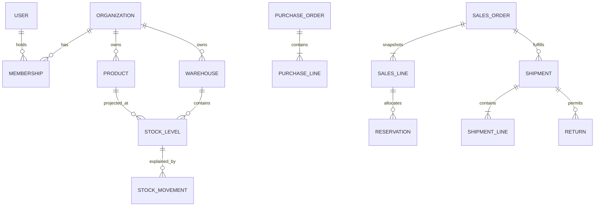

# Entity relationship diagram

Key constraints: SKU and warehouse code are unique per organization; quantities are positive on lines; stock is nonnegative and `reserved <= on_hand`; movements reject update/delete through triggers; idempotency is unique by organization, scope, and key.
