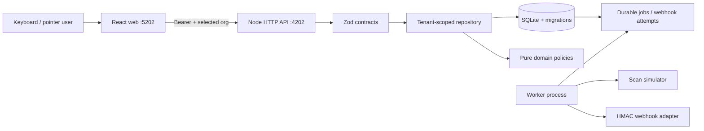
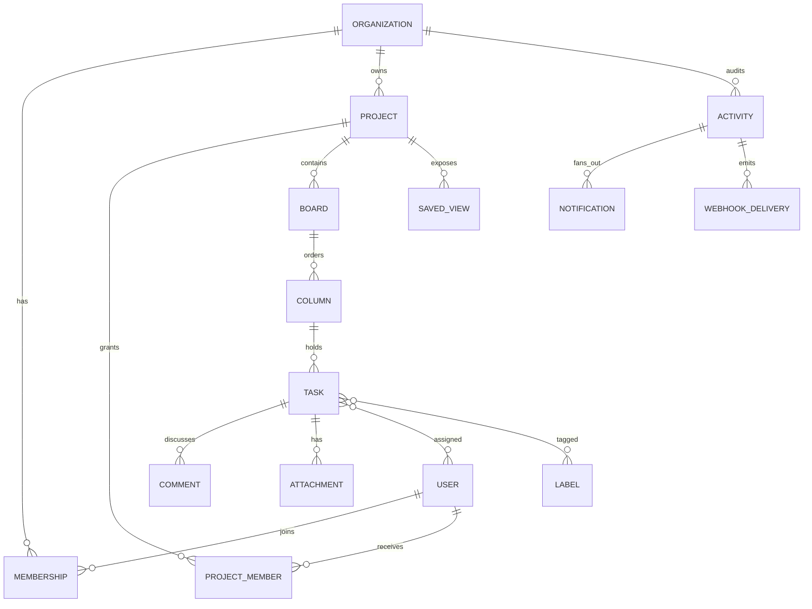

# Architecture

Dependency direction is UI/API adapters → contracts/domain → repository → SQLite. Tenant identity is established at the API boundary by joining the hashed session token to an active membership for the selected organization. The repository repeats organization predicates; guests additionally require a project grant. Errors are translated once at the HTTP boundary.

Task movement starts `BEGIN IMMEDIATE`, re-reads tenant-owned task/column state, verifies version, counts active destination tasks, calculates a sparse rank, updates the task, appends activity, stores the idempotent result, and commits. No observer can see a partial move. SQLite write serialization makes WIP races deterministic on one host.

## Entity relationships

All tenant-owned records either store `org_id` directly or are accessed through an organization-scoped parent. Foreign keys, checks, unique scopes, and transactions reinforce application policy. SQLite cannot express cross-table tenant equality as a normal foreign key; repository contract tests therefore remain mandatory.
