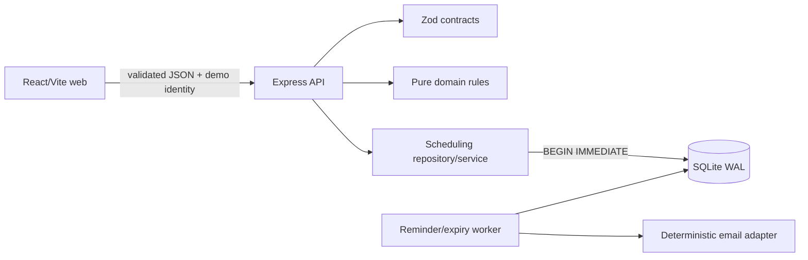

# Architecture

The API authenticates first and derives `organization_id` from the stored user. Handlers validate input, authorize an action, and call named scheduling commands. Domain code owns state, permission, interval, and local-time rules. SQL owns foreign keys, checks, unique idempotency keys, indexes, and atomic writes. The worker shares database access but does not import the HTTP application.

Correlation IDs cross the HTTP boundary. Error envelopes are `{ "error": { "code", "message", "correlationId" } }`; internal errors do not disclose details. SIGTERM stops new HTTP work and closes SQLite after the server drains.
