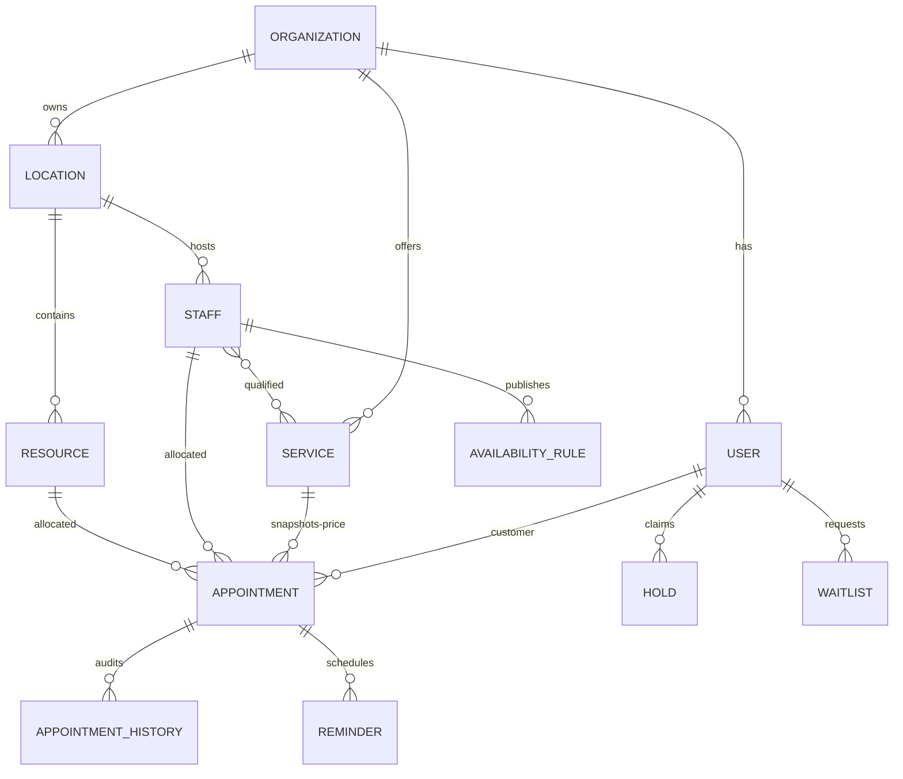

# Entity relationship diagram

Foreign keys prevent orphaned core records. Checks bound duration, price, capacity, roles, and states. Organization-scoped unique keys deduplicate holds and bookings. Interval indexes accelerate overlap checks; the repository serializes the check/write transaction.
