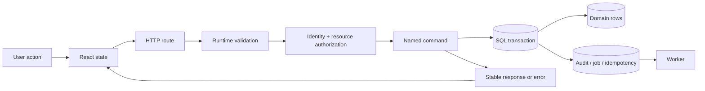

# How to learn from a real codebase

## The four-pass method

### Pass 1: map, do not memorize

Find the process boundaries, entry points, and dependency direction. Answer:

- What runs in the browser, API process, and worker process?
- Which package may import which other package?
- Where does untrusted data first become trusted?
- Where does a transaction begin and end?
- Which table or event explains what happened later?

Draw the answer before reading every function.

### Pass 2: trace one value

Choose one hostile value, such as `quantity = -1`, a task ID from another organization, or a slot token whose signature was changed. Trace it from React or HTTP through parsing, authorization, SQL, and the error envelope. Write down the exact function that stops it.

### Pass 3: predict and run

Before running a test, predict:

1. Which assertion will fail if you remove one guard?
2. Whether any data will have been written.
3. Which error code the caller sees.
4. Which audit/log evidence remains.

Then temporarily mutate the code, run the smallest test, and restore the guard. A green test you never saw fail is weaker evidence.

### Pass 4: teach back

Close the source and explain the feature in five minutes:

- contract;
- invariant;
- authorization decision;
- transaction boundary;
- concurrency/idempotency policy;
- user-visible failure;
- test oracle;
- operational limitation.

If you use words such as “safe,” “handles,” or “secure,” replace them with a mechanism and evidence.

## Same concept, different learning styles

### Analogy learner

Treat the system as an airport:

- Zod is passport control: a typed-looking document is not proof it is valid.
- Authorization is the boarding gate: identity alone does not grant every destination.
- A SQL transaction is closing the aircraft door: either the passenger list and bags both commit, or neither does.
- An idempotency key is a boarding pass number: scanning it twice must not create two passengers.
- An audit record is the flight recorder: append what happened; do not rewrite history.

### Visual learner

Redraw this from memory:



### Hands-on learner

Run one project and use three terminals:

```powershell
npm run db:reset
npm run dev
npm run dev:worker
```

In a fourth terminal, run one focused test. Watch how the browser/API/worker views correspond to database state and structured logs.

### Reading/writing learner

Keep a feature ledger with five columns: requirement, owning file, invariant, failure code, proof. One row per behavior is enough.

### Social learner

Pair in driver/navigator mode. The navigator is not allowed to dictate syntax; they must ask for the next observable fact. Swap every 15 minutes.

## Evidence ladder

Use the cheapest boundary that can prove the claim:

1. Pure function test for deterministic rules.
2. Parser test for runtime input.
3. Repository test for SQL constraints/transactions.
4. Real HTTP test for auth, status, headers, and serialization.
5. React test for what the user perceives and can do.
6. Process smoke for build, configuration, health, and shutdown.

A unit test cannot prove a database lock. An API test cannot prove keyboard focus. A TypeScript check cannot prove incoming JSON.

## Daily thirty-minute loop

- 5 minutes: write a prediction.
- 10 minutes: trace code and collect evidence.
- 10 minutes: change or test one boundary.
- 5 minutes: explain the result without source open.

Progress is measured by independent explanations and safe changes, not pages read.
