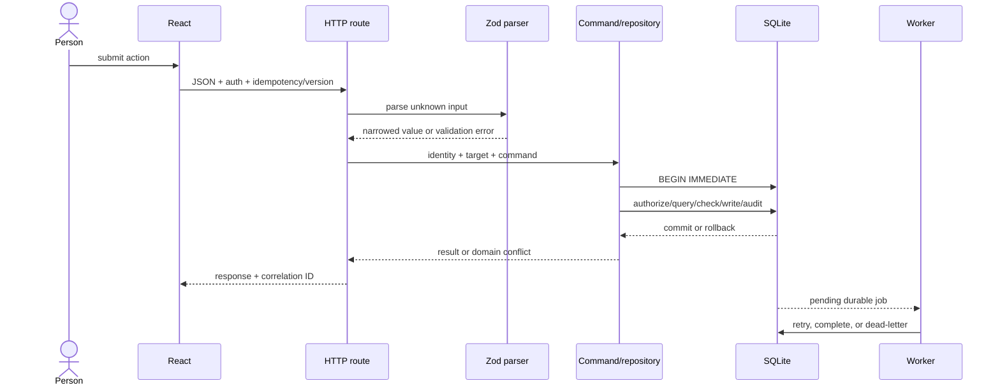

# Architecture tour: one shape, three invariants

## The shared shape

Each folder is an independent npm workspace. The repeated layout is intentional: you can compare domain decisions without first relearning the build system.

```text
apps/web       browser process and user-visible state
apps/api       HTTP process, authentication, orchestration, SQL access
apps/worker    independent retryable background process
packages/contracts  runtime parsers and externally meaningful shapes
packages/domain     pure rules, state machines, domain errors
packages/testing    deterministic builders/helpers
migrations     durable schema and constraints
docs           decisions, threats, architecture, and operations
```

The desired dependency direction is inward: web/API/worker may depend on contracts and domain; domain rules should not need Express, React, or a database.

## One request through every layer



### Why the route does not own every rule

Routes know HTTP: headers, status codes, request bodies, and response envelopes. Domain/repository code knows business meaning: stock cannot be oversold, WIP cannot be exceeded, and resources cannot overlap. SQL knows durable facts and constraints. Keeping these responsibilities distinct makes each rule testable at the cheapest trustworthy boundary.

## The three central invariants

| Project | Invariant | Dangerous interleaving | Protection |
| --- | --- | --- | --- |
| Inventory | `0 <= reserved <= on_hand` and every balance change has an immutable movement | Two orders reserve the final unit | immediate transaction, conditional update/check, idempotency, rollback test |
| Project management | destination task count never exceeds WIP and tenants never share results | Two task moves enter the final WIP position | tenant predicates, `BEGIN IMMEDIATE`, version, WIP check, durable command key |
| Scheduling | exclusive buffered resource intervals never overlap | Two customers confirm the last slot | signed candidate, server revalidation, immediate transaction, half-open overlap query |

## Vertical slice versus horizontal layer

A weak first implementation creates every table, then every route, then every page. Nothing works end-to-end until late. A vertical slice chooses one user outcome and connects all necessary layers. For example:

```text
Create task
  React form -> TaskCreate Zod schema -> POST route
  -> Repository.createTask -> projects/columns/tasks/activity SQL
  -> conflict/error envelope -> refreshed board
```

Once that slice works, the next command copies established boundary conventions while adding one new risk.

## Architecture questions a mid-level engineer asks

1. Is this rule pure, request-specific, or durable?
2. Which process owns the side effect?
3. Can a retry arrive after the first request committed?
4. Can two callers observe the same precondition?
5. Does every SQL query include the tenant/resource boundary?
6. What does the user see when the version is stale?
7. What evidence will an operator have after failure?
8. What changes when SQLite becomes PostgreSQL?

## Trace exercise

Trace these three functions side by side:

- inventory `createAndReserveSale`;
- project management `Repository.moveTask`;
- scheduling `createHold`.

For each, mark input validation, authorization, transaction start, reread/check, durable writes, idempotency, audit/history, commit, and error mapping. Some concerns are intentionally handled by the caller. The goal is to locate ownership, not force every function to look identical.
