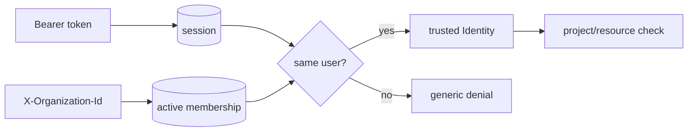

# HTTP, identity, and authorization

## Authentication is not authorization

Authentication answers “who presented this credential?” Authorization answers “may this identity perform this action on this exact resource?” A logged-in guest is still forbidden from another project; a provider is still forbidden from another provider’s appointment.

## Route anatomy

Read any project’s `app.ts` in this order:

1. request-size and CORS middleware;
2. correlation ID creation;
3. liveness/readiness routes;
4. credential resolution;
5. action/resource authorization;
6. request parsing;
7. named command call;
8. central error translation.

HTTP routes should be thin enough that this sequence is visible.

## Trusted tenant context

Project management accepts `X-Organization-Id`, but the repository joins that selection to an authenticated session and an active membership. The header chooses among existing authority; it does not create authority.



Inventory derives an organization/user tuple from its local session token, then rechecks membership. Scheduling resolves a seeded identity and applies role plus ownership/provider checks. These are demonstration authentication mechanisms; the authorization shape is the learning target.

## Preventing IDOR

An insecure object reference looks like:

```sql
SELECT * FROM tasks WHERE id = ?
```

The tenant-safe shape is:

```sql
SELECT * FROM tasks WHERE id = ? AND org_id = ?
```

For guests, project grants add another boundary. For customers, ownership adds `customer_id`. Authorization must apply to reads as well as writes, including search, attachments, activity, and exports.

## Why private denials may look like not-found

Returning “forbidden: task exists in Globex” leaks existence. Several routes intentionally collapse unauthorized private resources into a generic unavailable/not-found response. The authorization matrix documents where this behavior is expected.

## Error envelopes

A useful error response distinguishes malformed input, validation, authentication, conflict, gone/expired, and unexpected failure while returning a correlation ID. Internal exceptions and secret context should not leak into the message.

## Code review checklist

- Is tenant context derived from an active membership?
- Does the target resource query include tenant scope?
- Are child resources proven to belong to the authorized parent?
- Can a guest infer other projects through search counts or timing-sensitive errors?
- Does a role-aware UI still rely on server enforcement?
- Are errors stable enough for honest client states?

## Debugging exercise

Temporarily remove one `org_id` predicate in a test-only mutation. Run the cross-tenant test and observe the failure. If no test fails, add one before restoring the predicate. Do not use production/demo databases for the mutation.

## Teach-back

Trace project management from bearer token to `Repository.authorize`, then explain why adding a tenant ID to every body would be weaker.
