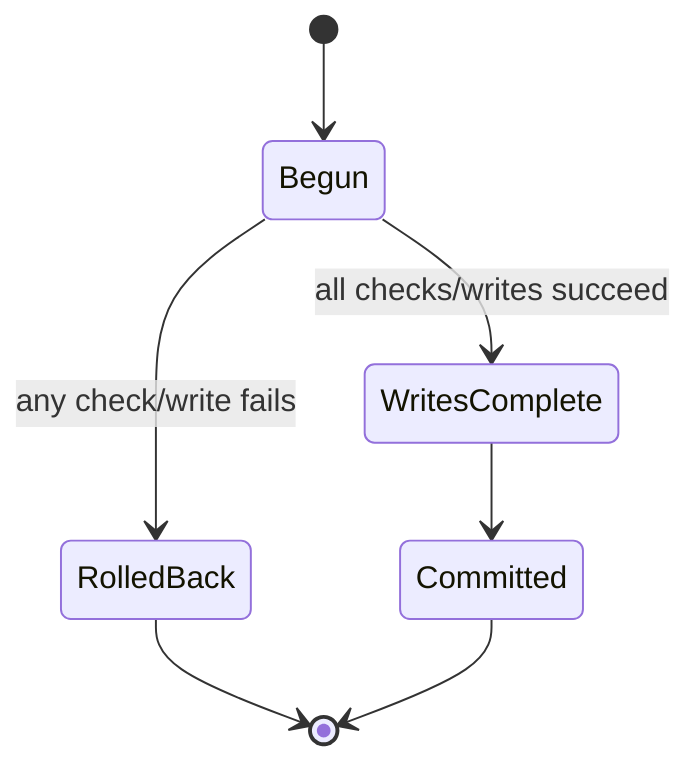

# SQL, constraints, and transactions

## Put durable invariants near durable state

Application checks create good error messages. SQL constraints prevent invalid committed data even if a future route forgets a check. Use both when practical.

Examples in these migrations include uniqueness, foreign keys, quantity checks, immutable-ledger triggers, and idempotency keys:

- [inventory migration](../01-inventory-orders/migrations/001_initial.sql)
- [project migration](../02-project-management/migrations/001_initial.sql)
- [scheduling migrations](../03-appointment-scheduling/migrations/)

## Atomicity

A transaction is required when one business command changes several durable facts. Inventory receipt updates stock, writes a movement, updates the line/order, writes audit, and records idempotency. Partial success would make reports lie.

Never catch an error inside a transaction and continue unless the business contract explicitly supports partial outcomes.

## SQLite `BEGIN IMMEDIATE`

SQLite does not provide PostgreSQL row locks. These applications serialize dangerous writes with an immediate transaction. That is credible for one database file/host and deliberately documented as a scaling boundary. A PostgreSQL version would usually use row/advisory locks, exclusion constraints, or serializable transactions depending on the invariant.

## Parameterized queries

Values belong in placeholders. Only allowlisted identifiers/order fragments may be interpolated. Inventory’s list route maps a validated sort enum to known SQL expressions; it does not paste arbitrary client input into `ORDER BY`.

## Migration properties

A migration system should prove:

- blank database application;
- deterministic ordering;
- repeat safety;
- transaction rollback on failure;
- upgrade behavior from an older realistic fixture.

The current projects emphasize blank/repeat behavior. Compatible production-grade downgrade and large-data rollout exercises remain explicit future work.

## Failure-injection lab

Read inventory’s [`rollback.test.ts`](../01-inventory-orders/tests/rollback.test.ts). It injects a failure after a movement-related write but before command completion, then inspects durable state. This is stronger than mocking `transaction()` and asserting it was called.

Create the same shape for one of:

- task creation after incrementing the project number but before task insert;
- reschedule after new-slot validation but before appointment update;
- worker delivery after provider success but before marking delivered.

## Socratic questions

- Why is “check available, then update later” unsafe?
- Which inventory table is historical truth and which is a projection?
- Why must audit and idempotency records normally commit with the domain write?
- What would break if foreign keys were disabled?
- When is a SQL trigger worth its hidden behavior cost?

## Teach-back

Open one transaction and narrate every possible exit. State exactly what remains in the database after each failure point.
