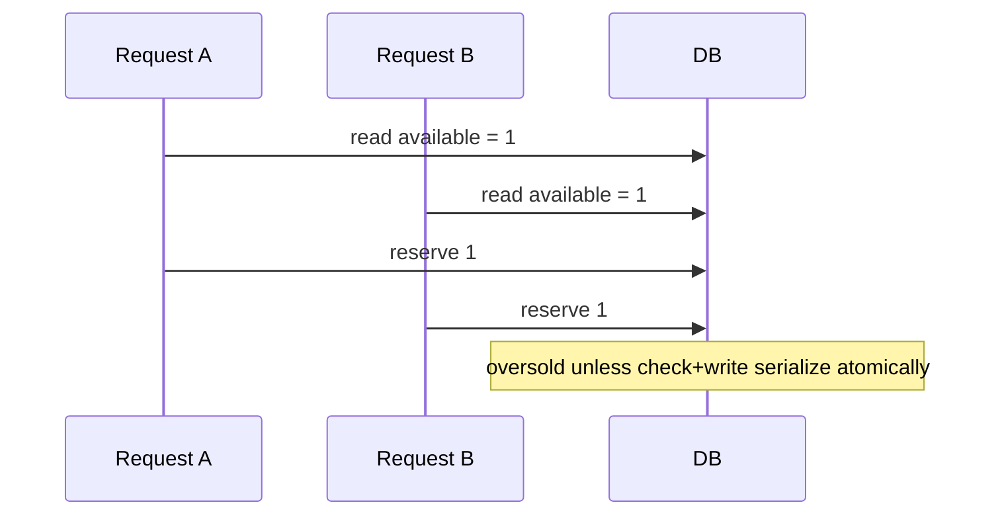

# Concurrency, versions, and idempotency

## Three different problems

Do not use one mechanism as a slogan for all concurrency.

| Problem | Example | Mechanism |
| --- | --- | --- |
| Competing writers | two buyers want one unit | transactional reread/check plus database write serialization |
| Lost update | two editors save task version 3 | optimistic version predicate and explicit conflict |
| Duplicate delivery | client retries after timeout | durable idempotency key and stored original response |

## A dangerous timeline

The fix is not “Node is single threaded.” Separate callbacks, processes, requests, or database connections can interleave.

## Optimistic concurrency

Project tasks and appointments have versions. An update includes `expectedVersion`; SQL or repository logic accepts it only if current state matches. A conflict returns current state so the UI can refresh, compare, or retry intentionally.

Optimistic concurrency is appropriate when collisions are uncommon and users need visibility rather than silent last-write-wins.

## Durable idempotency

An idempotency key is scoped to an organization and command/resource. The first committed result is stored. A retry returns that result without reapplying side effects. In-memory maps are insufficient because they disappear on restart and are not shared across processes.

Decide whether reuse with different input is allowed. A stronger production design stores an input hash and returns a conflict if the same key is reused for a different command body.

## Deterministic race tests

Read:

- [inventory final-unit test](../01-inventory-orders/tests/concurrency.test.ts)
- [project WIP test](../02-project-management/tests/concurrency.test.ts)
- [scheduling last-slot test](../03-appointment-scheduling/tests/concurrency.test.ts)

A useful race test controls the interleaving or uses separate real database connections with a known serialization point. “Start two promises and hope” can add pressure, but timing luck alone is a weak oracle. Never repair flakes by sleeping longer.

## Mutation questions

Predict which test fails if you:

1. move the inventory stock check outside the transaction;
2. remove task version comparison;
3. treat confirmed scheduling holds as active conflicts forever;
4. store idempotency only after returning the HTTP response;
5. key idempotency globally rather than by organization/scope.

## Teach-back

For one command, explain why it needs a lock/transaction, a version, an idempotency key, some combination, or none. Mechanisms should follow semantics.
