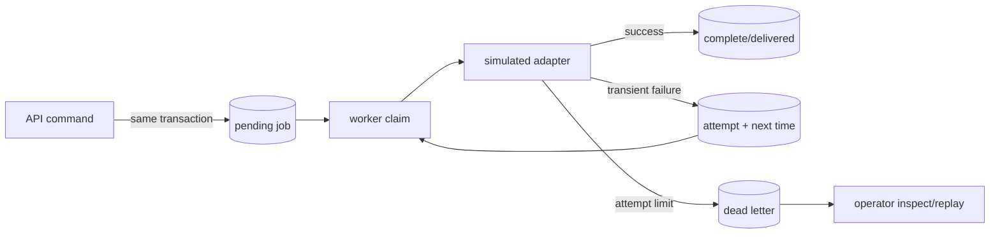

# Workers, reliability, and operations

## Why a separate worker exists

Some work should survive the HTTP request and be retried independently: notifications, scanning, reconciliation, webhook delivery, reminders, and hold expiration. The request transaction stores a durable job; a worker claims and processes it.



## Retry policy

Retry only failures that might succeed later. Bound attempts and delay. Record last error safely. Permanent validation or authorization failures should become visible immediately rather than loop forever.

Exponential backoff reduces synchronized pressure:

```text
delay = min(cap, base * 2^(attempt-1))
```

Production systems normally add jitter. Tests inject time and transports so they do not wait real minutes.

## Delivery ambiguity

The external provider may succeed while the process crashes before marking the job complete. Therefore outbound calls also need a provider idempotency key or reconciliation strategy. “Exactly once” is rarely available across a database and external service.

## Health and shutdown

- Liveness: the process is responsive enough to be restarted if false.
- Readiness: dependencies are available and the process should receive traffic.
- Graceful shutdown: stop accepting new work, finish or safely release current work, close server/database, and exit within a deadline.

Read each production entry point and locate signal handlers. Then start the built API/worker, send Ctrl+C, and verify structured shutdown logs.

## Operational reading exercise

Pick one runbook from each project. Verify every command still matches package scripts and paths. A runbook that was never rehearsed is a hypothesis.

## Debugging-first drill

Make the simulated adapter fail three times. From only logs and database rows, answer:

1. Which job failed?
2. How many attempts ran?
3. When was each retry eligible?
4. Why did it become dead?
5. Is replay safe?
6. Did the domain record change incorrectly?

## Teach-back

Explain why moving email sending directly into the booking/order/task transaction would reduce reliability even though it removes a table and process.
