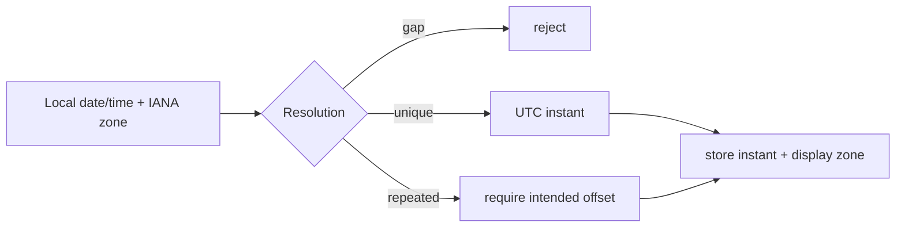

# Appointment scheduling code tour

## Product sentence

The system must translate future civil time into real instants and allocate every required resource exactly once, even when calendars, time zones, and requests race.

## Time model first

Read [`packages/domain/src/index.ts`](../../03-appointment-scheduling/packages/domain/src/index.ts). Focus on:

- appointment state transitions;
- half-open interval overlap;
- local-time resolution around daylight-saving changes;
- explicit error codes.

An instant is a point on the UTC timeline. A local time such as `2026-11-01 01:30 America/Los_Angeles` may identify two instants. A spring-forward time may identify none. An offset alone is not a durable time-zone rule.



## Schema walkthrough

Open [`migrations/001_initial.sql`](../../03-appointment-scheduling/migrations/001_initial.sql) and [`002_jobs.sql`](../../03-appointment-scheduling/migrations/002_jobs.sql). Separate configuration (locations/services/staff/resources/availability), customer intent (holds/waitlist), committed allocations (appointments), history, and delivery state (reminders/jobs).

Customer-visible intervals and allocation intervals differ because buffers consume resource time.

## Slot generation

[`discoverSlots`](../../03-appointment-scheduling/apps/api/src/scheduling.ts) performs bounded on-demand generation:

1. tenant-scope service and location;
2. fetch qualified active staff/rules and required room;
3. iterate at most 31 days;
4. resolve each local candidate in the location zone;
5. calculate customer interval and buffer-expanded allocation;
6. reject past/conflicting candidates;
7. render in requested display zone;
8. return at most 200 signed candidates.

The step includes duration plus before/after buffers so adjacent offered slots do not already conflict.

Current documented limitation: availability exceptions and location opening rules exist in the model but are not applied by this generator. Treat that as a real future feature, not hidden completeness.

## Signed slots are not authority

`encodeSlot` signs the candidate payload. This detects client tampering, but time passed and another customer may have booked it. `createHold` decodes, checks organization/customer, starts an immediate transaction, and calls `conflicts` again before insertion.

Security principle: a signed fact can become stale. Integrity is not freshness.

## Interval overlap

For half-open intervals `[start,end)`, two allocations overlap when:

```text
existing.start < candidate.end AND candidate.start < existing.end
```

Back-to-back `[09:00,10:00)` and `[10:00,11:00)` do not overlap. Buffers expand those boundaries before the comparison.

## Hold and booking lifecycle

`createHold` scopes idempotency by organization, rejects conflicts, and gives the hold a five-minute expiry. `confirmHold` returns an existing booking for a duplicate key, rejects missing/expired holds, snapshots service price, writes appointment/history/reminder, and marks the hold confirmed in one transaction.

## Lifecycle and rescheduling

`lifecycle` compares expected version and calls the exhaustive domain transition function. `reschedule` loads the original, verifies version/service/tenant, checks new conflicts while excluding the original allocation, then updates interval and history atomically. If anything fails, rollback preserves the original.

## HTTP authorization

[`app.ts`](../../03-appointment-scheduling/apps/api/src/app.ts) distinguishes admin/scheduler/provider/customer/reception capabilities. Customer list/cancel/reschedule operations are ownership-scoped. Provider actions prove staff assignment. Unauthorized private resources use generic not-found behavior.

## React walkthrough

[`main.tsx`](../../03-appointment-scheduling/apps/web/src/main.tsx) owns service/location/date/display-zone selection, live slot search, hold-confirm sequence, appointment list, and status announcements. Switching display zone changes formatting, not the underlying instant.

## Worker walkthrough

[`jobs.ts`](../../03-appointment-scheduling/apps/worker/src/jobs.ts) expires active holds idempotently and sends due reminders through an injected adapter. Attempts use bounded exponential delay and become dead after the limit. Reminder failure never changes appointment state.

## Test map

| Risk | Proof |
| --- | --- |
| state/interval rules | [`domain.test.ts`](../../03-appointment-scheduling/tests/domain.test.ts) |
| DST gap/repeated time | [`dst.test.ts`](../../03-appointment-scheduling/tests/dst.test.ts) |
| last-slot race and reschedule rollback | [`concurrency.test.ts`](../../03-appointment-scheduling/tests/concurrency.test.ts) |
| idempotent booking/history | [`integration.test.ts`](../../03-appointment-scheduling/tests/integration.test.ts) |
| reminder/expiry retries | [`worker.test.ts`](../../03-appointment-scheduling/tests/worker.test.ts) |
| customer UI semantics | [`react.test.tsx`](../../03-appointment-scheduling/tests/react.test.tsx) |

## Debugging scenarios

1. A November 01:30 booking is one hour wrong. Trace local zone, selected offset, UTC conversion, and display zone separately.
2. Two adjacent slots conflict. Compare customer versus allocation intervals and generation step.
3. A reschedule failure deletes the old booking. Find any release/write outside the swap transaction.
4. A reminder retries twice and changes appointment status. That violates process ownership; inspect worker writes.

## Mid-level teach-back

Explain gap versus repeated time, half-open intervals with buffers, why slot signatures are insufficient, and how rollback preserves an original appointment.
